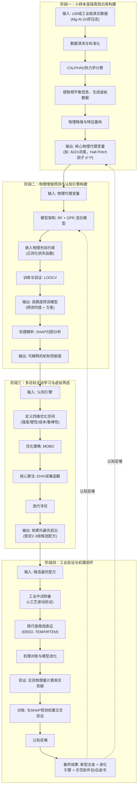

```mermaid
graph TD
    subgraph "阶段一：小样本高保真知识库构建"
        A1["输入: ≤30组工业级真实数据<br>(Mg-Al-Zn挤压态)"] --> A2["数据清洗与标准化"];
        A2 --> A3["CALPHAD热力学计算"];
        A3 --> A4["提取相平衡信息、生成虚拟数据"];
        A4 --> A5["物理降维与特征重构"];
        A5 --> A6["输出: 核心物理代理变量<br>(如: Al/Zn浓度，Hall-Petch因子 d⁻¹/²)"];
    end

    subgraph "阶段二：物理增强预测与认知引擎构建"
        B1["输入: 物理代理变量"] --> B2["模型架构: RF + GPR 混合模型"];
        B2 --> B3["嵌入物理先验约束<br>(正则化损失函数)"];
        B3 --> B4["训练与验证: LOOCV"];
        B4 --> B5["输出: 高精度预测模型<br>(预测均值 + 方差)"];
        B5 --> B6["机理解析: SHAP归因分析"];
        B6 --> B7["输出: 可解释的机制贡献度"];
    end

    subgraph "阶段三：多目标主动学习与虚拟筛选"
        C1["输入: '认知引擎'"] --> C2["定义四维优化空间<br>(强度/塑性/成本/鲁棒性)"];
        C2 --> C3["优化策略: MOBO"];
        C3 --> C4["核心算法: EHVI采集函数"];
        C4 --> C5["迭代寻优"];
        C5 --> C6["输出: 帕累托最优前沿<br>(锁定2-3组候选配方)"];
    end

    subgraph "阶段四：工业验证与机理闭环"
        D1["输入: 候选最优配方"] --> D2["工业中试制备<br>(±工艺波动验证)"];
        D2 --> D3["跨尺度微观表征<br>(EBSD, TEM/HRTEM)"];
        D3 --> D4["机理对账与模型进化"];
        D4 --> D5["验证: 实验物理量计算真实贡献"];
        D5 --> D6["对账: 与SHAP预测权重交叉验证"];
        D6 --> D7["认知反哺"];
        D7 --> D8["最终成果: 新型合金 + 进化引擎 + 示范软件包/白皮书"];
    end

    A6 --> B1;
    B7 --> C1;
    C6 --> D1;
    D8 -.->|"认知反哺"| A6;
    D8 -.->|"认知反哺"| B2;

```
