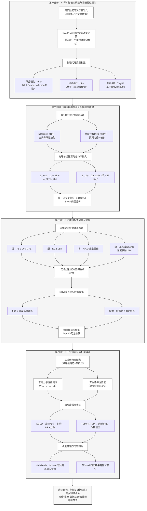

```mermaid
graph TD
    %% 样式定义
    classDef module fill:#f5f5f5,stroke:#333,stroke-width:2px;
    classDef subprocess fill:#fff,stroke:#666,stroke-width:1px;

    %% 第一部分：小样本知识库构建与物理特征提取
    subgraph A [第一部分：小样本知识库构建与物理特征提取]
        direction TB
        A1["真实数据清洗与标准化<br/>（≤30组工业/文献数据）"]:::subprocess
        A2["CALPHAD热力学高通量计算<br/>（固溶度、平衡相体积分数Vƒ）"]:::subprocess
        A3["物理代理变量构建"]:::subprocess
        A3a["细晶强化：d⁻¹/²<br/>（基于Zener-Hollomon参数）"]
        A3b["固溶强化：Sₛₒₗ<br/>（基于Fleischer理论）"]
        A3c["析出强化：Vƒ¹/²<br/>（基于Orowan机制）"]
        A1 --> A2 --> A3 --> A3a & A3b & A3c
    end

    %% 第二部分：物理增强的混合代理模型构建
    subgraph B [第二部分：物理增强的混合代理模型构建]
        direction TB
        B1["RF-GPR混合架构搭建"]:::subprocess
        B1a["随机森林（RF）<br/>全局非线性映射"]
        B1b["高斯过程回归（GPR）<br/>预测均值+方差"]
        B2["物理单调性正则化约束嵌入"]:::subprocess
        B2a["L_total = L_MSE + λ_phy·L_phy"]
        B2b["L_phy = Σ[max(0, -∂f̂_YS/∂cᵢ)]²"]
        B3["留一法交叉验证（LOOCV）<br/>SHAP归因分析"]:::subprocess
        B1 --> B1a & B1b
        B1a & B1b --> B2
        B2 --> B2a & B2b
        B2a & B2b --> B3
    end

    %% 第三部分：四维目标主动学习寻优
    subgraph C [第三部分：四维目标主动学习寻优]
        direction TB
        C1["四维协同评价体系构建"]:::subprocess
        C1a["强：YS ≥ 250 MPa"]
        C1b["塑：EL ≥ 15%"]
        C1c["本：Al+Zn含量最低"]
        C1d["稳：工艺波动±5°C<br/>性能衰减≤5%"]
        C2["十万级虚拟配方空间生成<br/>（10⁵组）"]:::subprocess
        C3["EHVI多目标贝叶斯优化"]:::subprocess
        C3a["利用：开发高性能区"]
        C3b["探索：挖掘高不确定性区"]
        C4["帕累托前沿解集<br/>Top-2/3配方推荐"]:::subprocess
        C1 --> C1a & C1b & C1c & C1d
        C1a & C1b & C1c & C1d --> C2
        C2 --> C3
        C3 --> C3a & C3b
        C3a & C3b --> C4
    end

    %% 第四部分：工业级验证与机理确证
    subgraph D [第四部分：工业级验证与机理确证]
        direction TB
        D1["工业级合金制备<br/>（半连续铸造+热挤压）"]:::subprocess
        D2["常规力学性能测试<br/>（YS、UTS、EL）"]:::subprocess
        D3["工业鲁棒性验证<br/>（温度波动±10°C）"]:::subprocess
        D4["跨尺度微观表征"]:::subprocess
        D4a["EBSD：晶粒尺寸、织构、DRX分数"]
        D4b["TEM/HRTEM：析出相Vƒ、位错组态"]
        D5["机制解耦与闭环对账"]:::subprocess
        D5a["Hall-Petch、Orowan理论计算真实贡献"]
        D5b["与SHAP归因结果背靠背验证"]
        D1 --> D2
        D1 --> D3
        D2 & D3 --> D4
        D4 --> D4a
        D4 --> D4b
        D4a & D4b --> D5
        D5 --> D5a
        D5 --> D5b
    end

    %% 强制模块顺序连接（唯一的单向链路）
    A --> B --> C --> D

    %% 最终目标
    E["最终目标：创制1-2种低成本高强韧镁合金<br/>形成“物理-数据双驱”智能设计新范式"]:::module
    D --> E

    %% 数据反哺：此处用文字说明循环，不添加箭头以免打乱顺序
    %% 实际闭环由“数据回填与模型更新”实现，图中用虚线箭头表示
    style E fill:#f9f9f9,stroke:#333,stroke-width:2px;
    
    class A,B,C,D,E module;
```
